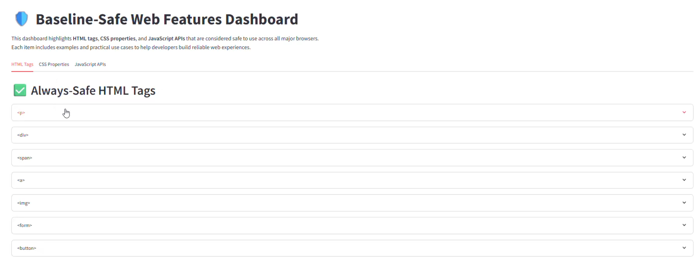
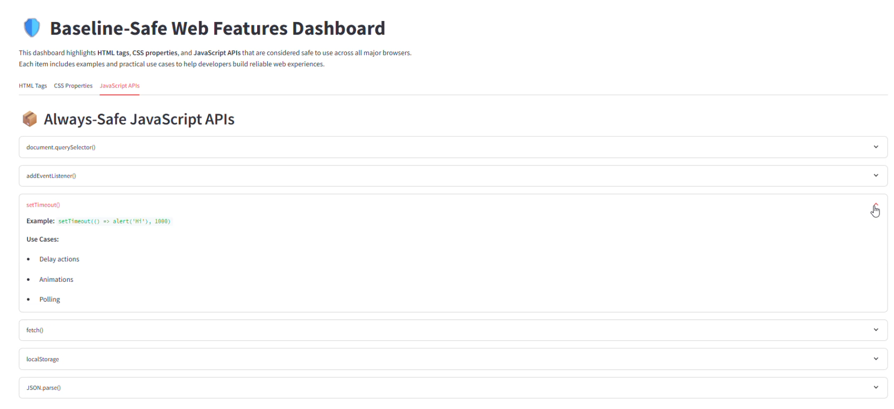
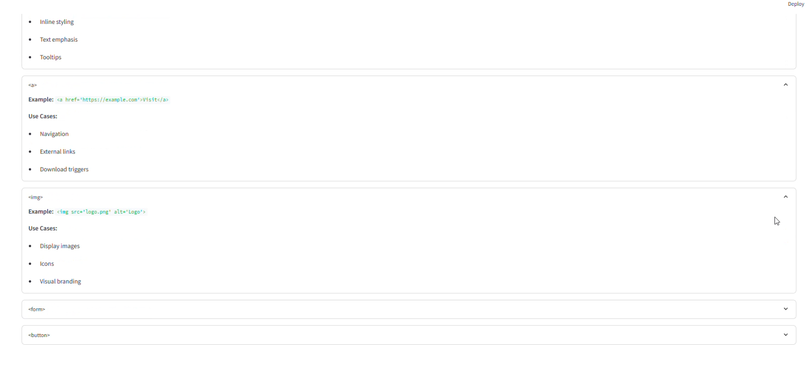

# Baseline-feature-hackathon-dashboard
Streamlit dashboard showing Baseline-safe HTML, CSS, and JS features made by using Python language.
# 📌 Project Name: Baseline Feature Dashboard

## 📝 Summary

Baseline Feature Dashboard is a web-based tool that helps to developers identify which HTML tags, CSS properties, and JavaScript APIs are safe to use across all major browsers without errors or compatibility issues also they will not be ignored by browser and will always run.  
It uses Baseline data to highlight consistently supported features, which reduces the need for manual compatibility checks.

## 🚀 Features

- **Interactive dashboard with categorized tabs for HTML, CSS, and JS**
- **Examples and use cases for each feature**
- **Educational layout for beginner-friendly learning**
- **Expandable sections for clean navigation**

## ⚙️ Functionality

- **Displays a curated list of Baseline-safe features**
- **Explains what each feature does and where it’s useful**
- **Helps developers write reliable, cross-browser code**

## 🛠️ Technologies Used

- **Python** for backend logic
- **Streamlit** for building the interactive dashboard
- **Markdown** for formatting content
- **GitHub** for version control and public hosting

## 📸 Demo

Here’s how the dashboard looks:

